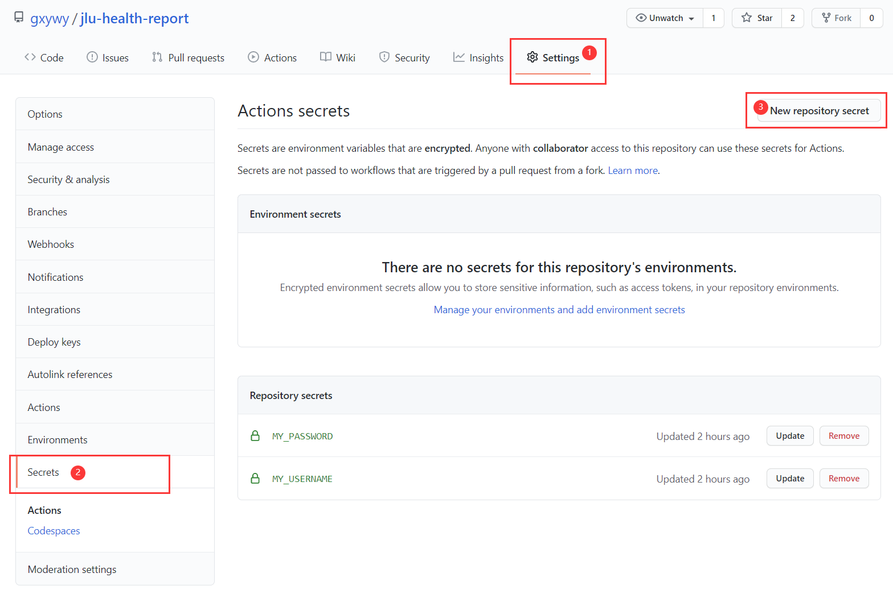
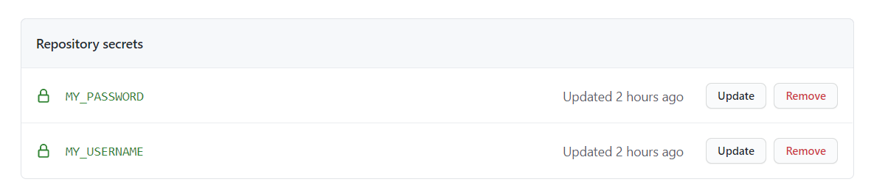
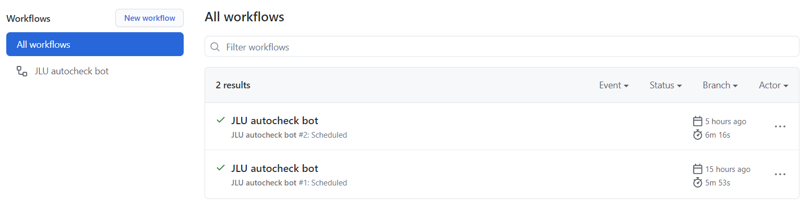

# jlu-health-report


吉林大学研究生自动健康打卡

- **自动获取并填入个人信息**
- **使用request直接发起请求，无需使用chromedriver**
- 定时自动打卡
- 支持多用户
- Github Actions自助打卡

# 使用方法

**若打卡系统页面更新，只需手动在打卡页面填入并提交一次，之后即可重新运行打卡程序，无需对程序进行修改**

------

- **单用户脚本模式**

```
python main.py --user [YourUsername] --pwd [YourPassword]
```

- **手动模式**

1. 填写`users.py`中一个或多个用户的用户名与密码
2. 运行`main.py`


- **定时自动模式**

1. 填写`users.py`中一个或多个用户的用户名与密码 
2. 运行`auto.py`，需要常驻后台

# Github Actions

本脚本支持使用Github Actions自助打卡，实现**无需本地常驻后台的自助打卡**

1. fork本repo

2. 点击Settings->Secrets，之后点击右上角的`New repository secret`添加2个secret

   

3. 第一个，`Name`字段中输入`MY_USERNAME`，`Value`字段中输入*你的用户名*

4. 第二个，`Name`字段中输入`MY_PASSWORD`，`Value`字段中输入*你的密码*

5. 添加2个secrets后如图

   

6. 最后点击repo首页顶部的`Actions`即可查看每日打卡情况

   

